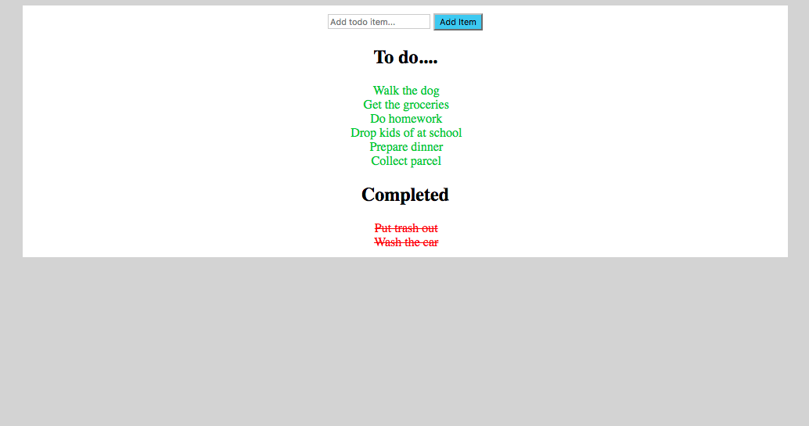

# Pure JavaScript Todo list Application

This simple app allows the user to add new items to a todo list and mark done items as completed.  There is no persistence in this application as the project was purely for practice using JavaScript in the browser so all data will be lost on refreshing the page.

The app is written using the following technologies:

* JavaScript
* HTML
* CSS

Tested using:

* Jasmine

## Getting Started
* Clone this repository to your computer
* Using your command line navigate to the directory where you have saved the clone and type 'open index.html' which will open the application in your default browser.

## Using the app
Simply type in the activity you wish to add to your todo list in the input field provided and click the button to add the activity.  Once you have completed an activity simply navigate your cursor to it and it will change colour.  Now click on the item and it will be transferred to the completed list.
